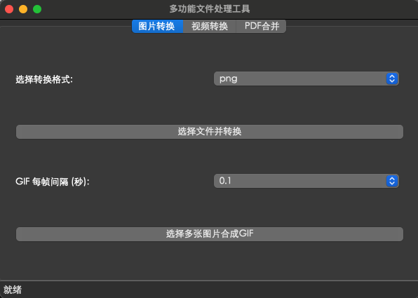

# 项目介绍

本项目主要为数字媒体工具，图片转换和图片转换，主要解决的问题是图片格式，大小。同时也增加了一个pdf合并的功能，可将多个pdf合并为一个。

由于该项目是使用python开发的，可以运行在任何平台上。

# 项目构成

该项目分为两个部份，

**ui/界面**

ui/panel : 文件夹为存放面板的地方，
 - image_converter_panel.py 为图片转换面板
 - video_converter_panel.py 为视频转换面板
 - pdf_merger_panel.py 为pdf合并面板

**utils/函数**

该文件夹主要放置一些转换函数
